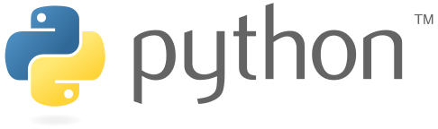
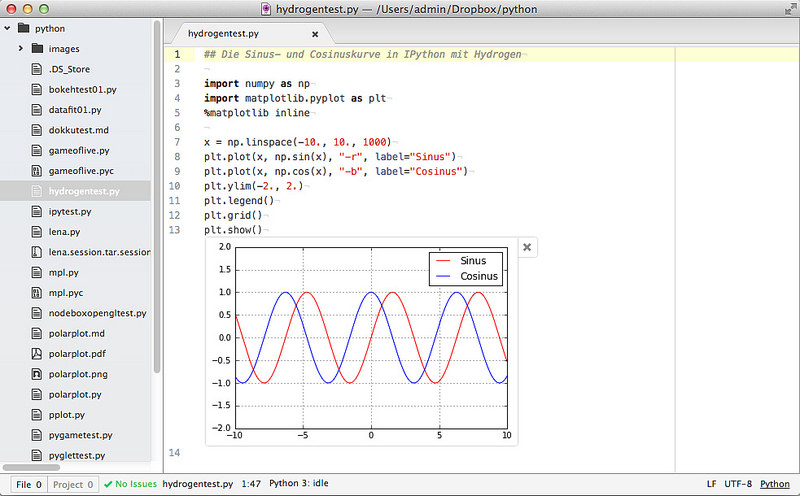
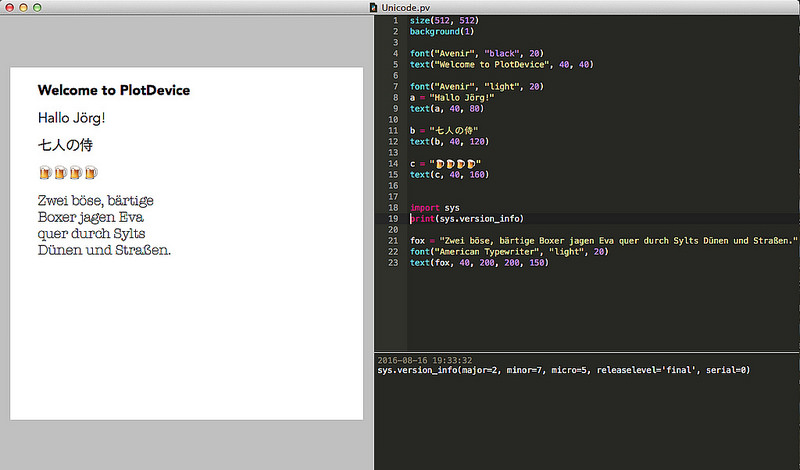

# Was ist Python?

```{r, echo=FALSE}
Sys.setenv(PATH="/Users/kantel/anaconda/bin")
```

Python[^pythonurl] ist eine universelle Programmiersprache, die üblicherweise interpretiert wird. Sie gilt wegen ihres kleinen Sprachkerns und der durch die Syntax  erzwungenen Strukturierung als leicht zu erlernen. Python wurde Anfang der 1990er Jahre von *Guido van Rossum* als Lehrsprache entwickelt.

[^pythonurl]: http://python.org

```{r, echo=FALSE, fig.margin = TRUE}

```

Auch wenn das Logo es vermuten läßt, stand nicht eine Schlange Pate für den Namen der Programmiersprache, sondern die britische Comedy-Truppe *Monty Python's Flying Circus*.

Es gibt mehrere Implementierungen von Python, die Referenzumsetzung ist CPython (Python in C geschrieben), dann gibt es eine Java-Implementierung von Python namens Jython, die in durchaus interessant ist und auch von mir in Form von Processing.py verwendet wird. Außerhalb meines Fokusses gibt es (mindestens) noch IronPython, eine Implementierung für die .NET- und Mono-Plattform und PyPy, ein in Python geschriebener Python-Interpreter (das klingt selbstreferentiell, aber es geht).

**Python**, genauer CPython existiert momentan in zwei Versionen: Da das im Jahre 2008 veröffentlichte Python 3 nicht mehr rückwärtskompatibel zu den vorherigen Python-Versionen war, wurde beschlossen, auch Python 2.7 noch bis 2020 weiterzuentwickeln. Aktuell ist dies die Version 2.7.5 und diese Version entspricht auch der von Apple mit dem Betriebssystem ausgelieferte Python-Interpreter. Der große Vorteil von Python 3 ist aber die weitestgehende Unicode-Unterstützung, daher werde ich mich auf Python 3 konzentrieren. Aber in allen Fällen, in denen es nicht um Unicode (UTF-8) geht, sollten die Beispiele auch mit Python 2.7.5 laufen. Auf eventuelle Besonderheiten und Unterschiede werde ich dann jeweils hinweisen.

**Jython** wiederum unterstützt in der aktuellen Version 2.7.1 von 2015 bisher nur den Sprachstandard von Python 2.7. Ein Jython 3 ist zwar schon seit längerem angekündigt, aber bisher noch nicht erschienen.

Python betont immer mit großem Stolz, daß es *batteries included* daherkommt. Gemeint ist damit die große Anzahl von Standardbibliotheken, die sowohl bei Jython wie auch Python einen großen Umfang abdecken und in beiden Sprachversionen gleich ist. In fast allen anderen Sprachen müssen für diese Funktionen  zusätzliche Pakete installiert werden.

# Warum Python?

In den letzten Jahren hat sich Python zu einer der führenden Entwicklungsumgebungen für wissenschaftliches Rechnen *(Scientific Computing)* und *Data Science* entwickelt.

# Python-Ökosystem

Im Rahmen dieses Grundkurses werde ich in der Hauptsache mit folgenden Implementierungen/Paketen und Programmen arbeiten:

  * (Anaconda-) Python 3
  * Numpy, Scipy und die Matplotlib (in Anaconda bereits enthalten)
  * Pandas (in Anaconda bereits enthalten)
  * Texteditoren: Atom und TextMate 2
  * Interpreter und Notebooks: Jupyter und IPython Qt-Konsole (ebenfalls in Anaconda bereits enthalten)
  * IDE: Rodeo
  * Processing.py
  * PlotDevice

# Anaconda

Anaconda ist eine freie Python-Distribution und eine Sammlung von über 720 Open Source Paketen, die mithilfe des eigenen Paket-Managers *conda* installiert werden können. Per Default wird gleich ein ganzer Stapel an wissenschaftlichen Modulen wie NumPy, SciPy, Pandas und die Matplotlib mitinstalliert. Dazu IPython mit den üblichen Tools – also dem Jupyter-Notebook und der QTConsole – und noch einen *Launcher* als Kommandozentrale. Das Nette: Die Installation geht in einen eigenen Pfad, es wird also keine andere Python-Installation tangiert, speziell das von Apple mitinstallierte System-Python bleibt unberührt.

# Interpreter

Den Python-Interpreter ruft man im Terminal mit dem Befehl `python` auf. Komfortabler arbeitet es sich allerdings mit **IPython**, einen erweiterterten Python-Interpreter mit vielen zusätzlichen Funktionen. IPython kann man sowohl im Terminal, wie auch in einem speziellen Programm, der QT-Konsole, aufrufen. Daneben ist es der Interpreter, der per Default im Jupyter-Notebook werkelt.

Wie ich später noch zeigen werde, kann man IPython auch direkt in dem freien Atom-Texteditor von GitHub mithilfe des Paketes Hydrogen nutzen. Und auch der Interpreter der IDE Rodeo (siehe unten) ist IPython.

# Editoren

Eigentlich kann man mit einem beliebigen Text-Editor Python-Programme schreiben. Einige bieten allerdings besondere Unterstützung. Auf dem Mac ist das freie (GPL) **TextMate 2** in der Regel der Editor meiner Wahl. Daneben ist aber auch **Atom** eine gute, freie und plattformunabhängige Alternative, in der zudem auf Wunsch direkt interaktiv mit IPython gearbeitet werden kann.

In der Regel nutze ich TextMate 2 zusammen mit einer geöffneten QT-IPython-Konsole – zum schnellen Ausprobieren – zur Python-Entwicklung. Nachdem ich das Paket Hydrogen allerdings entdeckt habe, probiere ich auch viele Dinge in Atom zusammen mit diesem Paket aus:

```{r, echo=FALSE, fig.cap="Atom mit Hydrogen"}

```

# Notebook

Das Browser-basierte IPython Notebook **Jupyter** ist so etwas wie das *working horse* in der wissenschaftlichen (I)Python Community. Es bietet Persistenz und eine Markdown-Unterstützung und ist daher für *literate programming* und *reproducible research* nahezu ohne Alternative. Da ich allerdings das Editieren im Browser nicht besonders mag, suche ich dennoch nach Alternativen.

# Integrierte Entwicklungsumgebungen

Obwohl man zur Entwicklung von Python-Programmen eigentlich nur einen Texteditor und einen Interpreter benötigt, gibt es eine ganze Reihe integrierter Entwicklungsumgebungen (IDEs) für Python. Bekannt sind zum Beispiel **PyCharm**, das es sowohl in einer kommerziellen wie auch in einer freien *Community Edition* gibt und das bei Anaconda mitinstallierte **Spyder**. Mir persönlich sind sie alle zu behäbig, aber das ist sicher zum größten Teil Geschmackssache. Lediglich das für die Bedürfnisse von *Data Science* entwickelte freie **Rodeo** ist in meinen Augen hinreichend flott und wird daher hin und wieder in dieser Schulung Verwendung finden. Rodeo besaß mal eine (rudimentäre) Markdown-Unterstützung und machte es daher auch zu einem Kandidaten für *literate programming* und *reproducible research*. Leider ist diese Unterstützung seit der Version 2.0 der IDE verschwunden. Ich hoffe jedoch immer noch, daß sie wieder in verbesserter Form auftaucht.

Die Entwicklung von Rodeo ist sehr stark von **RStudio** beeinflußt, einer IDE für das freie Statistikpaket R. RStudio besitzt alles, um (mit *RMarkdown* und *knitr*) publikationsreife Arbeiten innerhalb der IDE zu erstellen, sowohl für das Web wie auch via LaTeX für Print, und diese sind nicht auf R beschränkt. Seit einiger Zeit wird zum Beispiel (bis auf die graphische Ausgabe) auch Python unterstützt. Daher sollte man RStudio als eine mögliche (zukünftige) Alternative weiter beobachten.

# Processing.py und PlotDevice

**Processing.py** ist eine Python-Implementierung der speziell für Visualisierungen, Design und *Creative Coding* entwickelten Programmierumgebung **Processing**. Processing setzt auf Java auf und daher ist Processing.py eine Jython-Implementierung. Eine besondere Stärke von Processing und damit auch von Processing.py ist die einfache Erstellung von interaktiven Animatonen und Visualisierungen. Ein Nachteil ist, daß Jython (und damit auch Processing.py) systembedingt nicht mit den in C programmierten Paketen Numpy, SciPy und Pandas zusammenarbeiten kann.

```{r, echo=FALSE, fig.cap="PlotDevice kann Unicode"}

```

Wer auf eine Plattformunabhängigkeit verzichten kann, für den kann **PlotDevice** eine Alternative zu Processing.py sein. Die Software ist eine Art *stand alone* Python-Interpreter mit integrierter graphischer Ausgabe. PlotDevice ist der aktuelle Nachfolger von NodeBox und wurde wie diese mit der PyObjC-Bridge entwickelt. PlotDevice läuft daher nur auf einem einigermaßen aktuellen Mac (mindestens MacOS X 10.9.5). Die Stärke von PlotDevice ist weniger die Interaktion als das Bereitstellen von optisch gut aussehenden Visualisierungen und Animationen (letztere können direkt als QuickTime-Movies exportiert werden). PlotDevice läuft nur mit dem System-Python von Apple, von dem Versuch, es mit einem anderen Python (zum Beipiel Anaconda) zu »verheiraten«, raten die Entwickler ausdrücklich ab). Trotzdem ist PlotDevice weitestgehend Python-3-kompatibel und besitzt wie dieses eine weitgehende Unicode-Unterstützung. Und Apples System-Python kann man – falls nicht schon vorhanden – auch NumPy, SciPy, Pandas und andere *third party*-Pakete unterjubeln.

Auch wenn die Zukunft von PlotDevice nicht ganz klar ist (das letzte Update auf GitHub ist vom 27. Juli 2015), werde ich einige Beispielprogramme mit PlotDevice zeigen. In der Regel setzte ich allerdings auf Processing.py, das aktuell ständig noch Updates erfährt und von der *Processing Foundation* unterstützt wird.

# Hallo Welt

Jede Einführung in eine Programmiersrpache beginnt mit einem »Hallo Welt«-Programm. In Python ist dies von erfrischender Kürze:

```{python}
print("Hallöchen Welt!")
```
